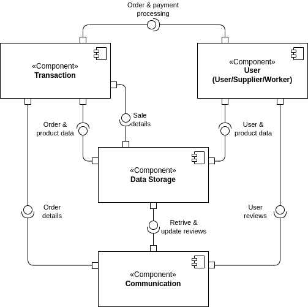
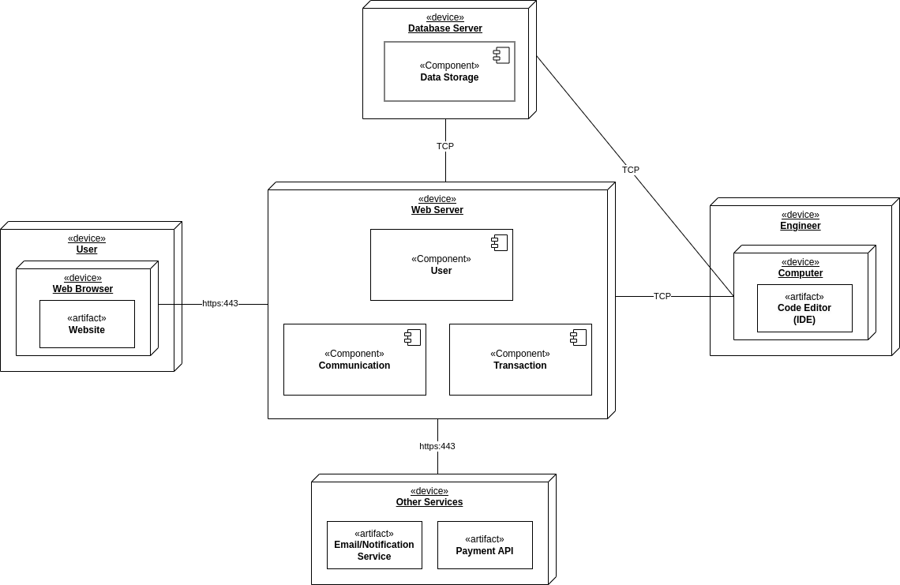

# 2DT902 : Assaignment 1 : [Samuel Berg(sb224sc)](mailto:sb224sc@student.lnu.se)

## Uppgift 1.

**User/Supplier components**
- User Authentication & Registration
    * Account creation
    * Login
- Profile Management
    * Delivery Address
    * Payment Information/Option
    * Order Managment(including previous orders)
- Search & Products Management
    * Start page with popular/recommended products
    * Search feature

**Employee components**
- Product management
    * Manage availability of products
    * Manage services
- Manage Customer accounts
    * View Delivery options
- Manage Orders
    * Change order status
    * Cancel/Refund Orders
- Supplier Management
    * Manage Supplier Information
- Reporting
    * View Daily/Weekly/Monthly/Yearly reports

**Transaction components**
- Cart
    * Adding & Removing of products
- Delivery Options
    * Pick-up at store
    * Delivery Service
- Payment API
    * Third-party payment integration
- Reporting
    * Number of Sales
    * Value of Sales
    * Number of Sold Products(of each product)

**Communication components**
- Order status
    * Notified on updates on your order(recived, sent, delivered, ready for pick-up)
- Product reviews/feedback
    * Can leave reviews on products and services that they have ordered and recived
- Reporting
    * Collect Summary of Reviews

**Data storage component**
- Stores the data of all other components

The ***user/supplier component*** provides the user/supplier interactions with the system. For users, they provide a way to manage personal information, browse products, and place orders. For suppliers, they ensure that product availability is updated and relevant.

The ***employee component*** are crucial for the operational management of the pet shop. They ensure that the inventory and details are up-to-date, customers receive the correct orders, and management has the necessary information for effective business decisions.

The ***transaction component*** are essential for the core transactional functions of the pet shop, enabling customers to purchase products and services while providing the business with detailed insights into the preformance of sales.

The ***communication component*** are important for maintaining a positive customer experience. They keep customers informed and engaged, and the feedback mechanism provides valuable insights into customer satisfaction and product quality.

The ***data storage component*** is the backbone of the system, ensuring that all information is securely stored, accessible, and retrievable for various functionalities across the system. It supports all operations and reporting needs by providing a central repository for all data.

## Uppgift 2. 

**User/supplier component**
- Provides
    * User/supplier data to *Data storage*, *Employee* & *Communication*
    * Order data to *Transaction*
    * Review data to *Communication*
- Requires
    * Fetch user/supplier data from *Data storage*
    * Fetch product data from *Data storage*
    * Order & payment processing from *Transaction*

**Employee component**
- Provides
    * Product data to *Data storage*
    * Order data to *Data storage*
    * Order status to *Communication*
- Requires
    * User/supplier data from *User/supplier*
    * Employee data from *Data storage*
    * Review data from *Communication*
    * Order data from *Transaction*

**Transaction component**
- Provides
    * Order & payment processing to *User/supplier*
    * Sale data to *Data storage*
    * Order data to *Communication* & *Employee*
- Requires
    * Order data from *User/supplier* & *Data storage*
    * Product data from *Data storage*
    * Order status from *Communication*

**Communication component**
- Provides
    * Order status to *Transaction*
    * Review data to *Employee* & *Data storage*
- Requires
    * Order data from *Transaction*
    * Review data from *Data storage* & *User/supplier*
    * Order status from *Employee*
    * User/supplier data from *User/supplier*

**Data Storage component**
- Provides
    * Order data to *Transaction*
    * Product data to *Transaction*
    * User/supplier data to *User/supplier*
    * Employee data to *Empolyee*
    * Review data to *Communication*
- Requires
    * Review data from *Communication*
    * Sale data from *Transaction*
    * User/supplier data from *User/supplier*
    * Product data from *Employee* & *User/supplier*
    * Order status from *Employee*

***User/Supplier component*** **requires** user/supplier data to provide the user with the details from previous orders and previous visit to the site where they may have put something into their cart, product data to make sure they have the most up-to-date prices and in-stock details and order & payment processing to be able to purchase and check-out the items in their cart. **Provides** authentication to be able to make sure someone other the the actual user/supplier access the account in question, profile managment to be able to update their personal details such as payment options and delivery address and order history interfaces to be able to view order status and view their previous purchases with out store.

***Employee component*** **requires** user/supplier data to be able to view this data incase of user/supplier is in need of support, employee data(to give employee privleages throughout to store and data storage) to be able to view, handle, manage and update details of things such as products, review data to be able to see sale statistics and to be able to think of possible ways to improve the store for future user/suppliers as well as improve to stock that the store provides and order data to be able to update orders status for example when they have been prepared and sent out for delivery. **Provides** product, customer, supplier management interfaces for the empolyees to be able to carry out their day-to-day tasks and to be able to provide the customers with good services.

***Transaction component*** **requires** order data to be able to view stored items in carts and to be able give users/suppliers the possibility to view their old orders, product data to be able to give the most up-to-date prices and in-stock quantity and order status to be able to give the user/supplier an estimate of delivery time. **Provides** cart, order processing and payment intergration interfaces for the user/supplier to be able to have a plesent experience to view their cart and handle their payment in an simple and secure way.

***Communication component*** **requires** order data(including order status) & user/supplier data to be able to send out notifications to the user/supplier about updates to their order and review data to be able to provide detailed reports of user reviews and sales to empolyees. **Provides** order status and review management interfaces to send out notifications about orders to users/suppliers and to employees to be able to see when sales and user reviews are availible to be viewed.

***Data Storage component*** **requires** review data, sale data, user/supplier data, product data and order data(including order status) are all required to be able to be provideded to all the diffrent components of the system. **Provides** review data, sale data, user/supplier data, product data and order data(including order status) are provided to the components that requiers them to function as intended, if they are not needed by a component it is not provided and just kept in storage.

## Uppgift 3.

## Uppgift 4.

- Backend
    * Web server hosting the website(possibly linux server install with apache or Nginx) and for the website it self the backend could be built with rust, javascript as an example.
    * Database server to host the database could be done with mysql, mongoDB as examples.
    
    Note: Separate servers for website/web server then database and in practice, they just need to be connected so that they can communicate with each other and provide the information needed.

- Frontend
    * Users/suppliers should be able to access the website via a web browser for any type of device that has any web browser capability, and the website shall be responsive so that all deviceses has a good experience viewing and navegating the website.

- Other/services
    * Third-party payment API to process payment that supports all the asked for and reasonable payment options our users/suppliers want.
    * Notification/email service to provide notifications to both users/suppliers and employees, this includes newsletter, sales and order notifications via Gmail, outlook, etc.

- Maintenance
    * For an engineer to be able to update, fix or change diffrent parts of the website or server with an code/text editor(IDE), they will need a computer of that is able to connect via SSH (TCP) to both the web server and the database server.

## Uppgift 5.

