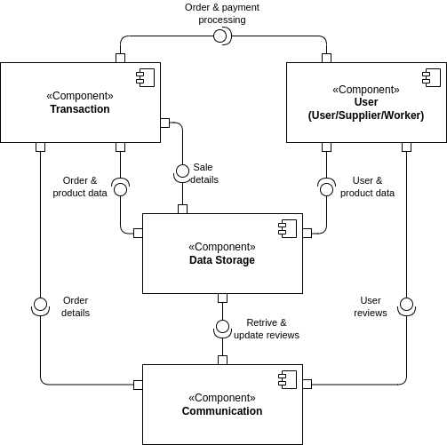
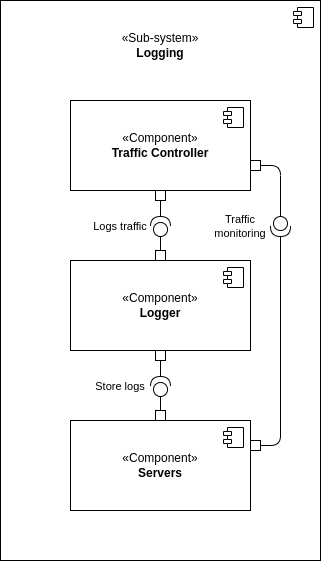
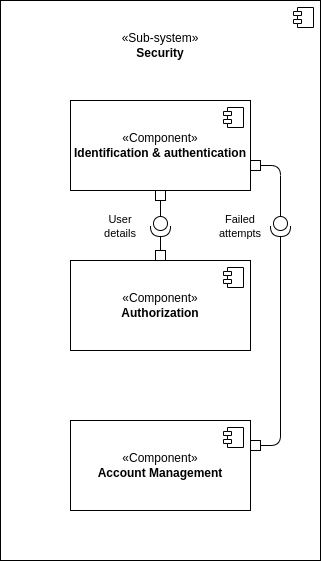

# 2DT902 : Project : [Group 2](mailto:sb224sc@student.lnu.se)

<!-- [link to document on gdrive](https://docs.google.com/document/d/1H6UAzhqQBWQc88c6wg2Y2SLOo98k4P8d5MFhyZ5edHs/edit?pli=1&tab=t.0) -->

## Table of Contents
- [Assumptions](#assumptions)
- [Persistence](#persistence)
  - [Requirements](#requirements)
  - [Solutions](#solutions)
  - [Security Components](#security-components)
- [Logging](#logging)
  - [Requirements](#requirements-1)
  - [Solutions](#solutions-1)
  - [Security Components](#security-components-1)
- [Security](#security)
  - [Requirements](#requirements-2)
  - [Solutions](#solutions-2)
  - [Security Components](#security-components-2)
- [Images](#images)

### Assumptions

- Assume that user reffers to a logged in user, one that has a registered account or one that is in the process of making an account. Meanwhile an unidentified user refers to someone that does not have an account and browsing around the online shop. 

### Persistence

### Requirements

- High availability and data resilience in case of failures.
- Consistent data integrity across all views and transactions.
- Maintenance readiness that minimizes downtime and ensures reliability during upgrades.

#### QAS 1 : Data Availability 

This scenario addresses the system's ability to recover and maintain data integrity after an unexpected power outage and ensures the system’s resilience to power disruptions, enabling continuity of service with minimal downtime.

**Source**: Unexpected power outage.

**Stimulus**: The system is restarted after an unexpected power outage.

**Artifact**: Web-server.

**Environment**: System has just recovered from an unexpected shutdown.

**Response**: The system should restore all the data exactly as it was before the outage, with no data loss or corruption.

**Response Measure**: All data is accessible and system is fully operational within x minutes.

#### QAS 2 : Data Integrity

This scenario ensures that any modifications to data within the system are accurately reflected across all relevant components, preserving data consistency and traceability and emphasizes the system’s ability to handle real-time data updates reliably, ensuring that all dependent views and reports reflect the latest information.

**Source**: An Employee.

**Stimulus**: An employee updates the price of a product in the inventory.

**Artifact**: Web-server.

**Environment**: System is fully operational.

**Response**: The system ensures that the price update is reflected across all orders, reports, and inventory views. The old price is archived (logs).

**Response Measure**: The update is applied across the system within 2 seconds (MySQL/PostgresSQL).

#### QAS 3 : System Maintenance

This scenario focuses on the system's ability to perform essential maintenance tasks efficiently, minimizing downtime and ensuring data protection and ensures that maintenance activities are conducted efficiently, preserving data integrity and minimizing impact on system availability.

**Source**: System Administrator.

**Stimulus**: Administrator initiates a system upgrade during off-peak hours.

**Artifact**: Database and web-server.

**Environment**: System is partially operational (only administrator access is allowed).

**Response**: The system should allow data migration, backup, or configuration changes with minimal downtime, while ensuring no data loss.

**Response Measure**: Maintenance tasks are completed and system is back online within 15 minutes.

### Solutions

#### QAS 1 : Data Availability 

##### **Alternative 1 : Database Replication with Automatic Failover**

**Pros:**

- Ensures high availability and rapid recovery.
- Protects against hardware failures by distributing data copies.

**Cons:**

- Additional server costs for replication.
- May require complex setup and monitoring.

##### **Alternative 2 : Regular Backups with Manual Recovery**

**Pros:**

- Lower cost than replication.
- Simpler to implement and manage.

**Cons:**

- Longer recovery time in case of an outage.
- Risk of some data loss between backup intervals.

##### **Our choice: Alternative 1**
Motivation for choosing Alternative 1: Database Replication with Automatic Failover
- In an online store environment, high availability is crucial to maintaining customer satisfaction and avoiding lost sales. With automatic failover, the system can quickly recover from hardware failures without significant downtime, ensuring a seamless user experience.
- While the additional server costs may be a concern, the cost of downtime or lost sales far outweighs the investment in redundancy. The more complex setup and monitoring are manageable with the right tools and resources, and the benefits of minimizing downtime make it worthwhile.

#### QAS 2 : Data Integrity

##### **Alternative 1 : Database Transactions with Versioning**

**Pros:**

- Ensures atomicity and prevents data corruption during updates.
- Maintains history for rollback or auditing.

**Cons:**

- Higher storage requirements due to versioning.
- Potentially slower for frequent updates.

##### **Alternative 2 : Event Sourcing for Data Changes**

**Pros:**

- Allows rollback and auditing by preserving events.
- Effective for tracking data changes over time.

**Cons:**

- Adds complexity in data retrieval.
- More challenging to query current state.

##### **Our choice: Alternative 1**
Motivation for choosing Alternative 1: Database Transactions with Versioning
- Database transactions with versioning offer a reliable, well-understood mechanism to ensure data integrity. Atomicity prevents partial or corrupted data from being saved, which is essential for an e-commerce platform where accuracy and consistency are critical.
- The higher storage requirements are an acceptable trade-off for the added reliability, and while frequent updates may cause performance hits, the added complexity of event sourcing (Alternative 2) may introduce challenges that are unnecessary in this context.

#### QAS 3 : System Maintenance

##### **Alternative 1 : Rolling Updates**

**Pros:**

- Minimizes downtime by updating components sequentially.
- Allows system to remain accessible to users during updates.

**Cons:**

- Requires support for backward-compatible updates.
- More complex deployment process.

##### **Alternative 2 : Scheduled Downtime for Maintenance**

**Pros:**

- Easier to implement with fewer compatibility concerns.
- Lower infrastructure demands as it doesn’t require redundant setups.

**Cons:**

- System is completely inaccessible during updates.
- Might impact user experience if not scheduled during low traffic.

##### **Our choice: Alternative 1**
Motivation for choosing Alternative 1: Rolling Updates
- Rolling updates are ideal for online platforms that require continuous availability. They allow updates to be deployed incrementally, ensuring that there is no single point of failure and users can continue interacting with the site during the process.
- Despite the added complexity of ensuring backward-compatible updates, the ability to avoid scheduled downtime and ensure consistent service for users is more valuable in the long run. This approach minimizes disruptions and enhances the user experience.

#### Security Components

##### **Authentication component**

###### **Responsibilities:**

- Manages user login, logout, and session handling.

###### **Provides:**

- Secure access control for employees and customers.

###### **Requires:**

- Secure storage for user credentials, preferably with encryption.

###### **Choice of technology/software:** 

OAuth 2.0 or OpenID Connect.

##### **Access Control Component**

###### **Responsibilities:**

- Defines and enforces access permissions based on contextual factors such as device, location, and time, rather than user roles.

###### **Provides:**

- Context-based access management that dynamically adjusts permissions for employees and customers, considering the context of each access attempt (e.g., IP address, device type).

###### **Requires:**

- Integration with the Authentication Component for MFA and CBAC policies.
- Access to the user database for verification of context-based conditions and session validation.

###### **Choice of technology/software:**

Context-Based Access Control (CBAC), integrated with Multi-Factor Authentication (MFA) for added security.

### Logging

### Requirements

- Reliable error detection and administrator alerts for quick troubleshooting and system recovery.
- Accountability in data modification by recording changes made by authorized users, providing a full audit trail.
- Secure and auditable transaction logging that supports financial data integrity and compliance.

#### QAS 1 : System Error 

This scenario addresses the handling of system errors caused by hardware or software failures, such as a database connection failure or server crash. The system is designed to immediately capture and log error information in a centralized logging service, ensuring administrators are promptly notified of the issue. This rapid response allows for effective troubleshooting and system recovery.

**Source**: System (hardware or software failure).

**Stimulus**: A system error occurs (database connection failure or server crash).

**Artifact**: Error logs stored in a centralized logging service (e.g., ELK stack, Cloud logging).

**Environment**: The system encounters an error while processing requests.

**Response**: The system logs the error, including a description of the affected service, the severity level and the time-stamp. Alerts may be sent to administrators.

**Response Measure**: The error is logged instantly, and the administrators are notified for immediate troubleshooting.

#### QAS 2 : Data Modification

This scenario focuses on the modification of critical system data, such as changes to product prices or inventory details by authorized users like administrators or employees. The system ensures that every modification is logged with key details, including the user's identity, the data before and after the change, and the timestamp. This audit trail ensures accountability and traceability for all changes to critical system data.

**Source**: Authorized user (admin or employee).

**Stimulus**: A user modifies critical data (product price or inventory details).

**Artifact**: Database/API.

**Environment**: The system is fully operational.

**Response**: The system logs the modification, capturing the user's identifier, the data before and after the change, the resource affected and the time-stamp.

**Response Measure**: Modifications are logged in real-time, ensuring an audit trail of changes to critical system data.

 #### QAS 3 : Transaction

This scenario covers the logging of transaction events initiated by customers, particularly payment attempts for orders. Whether the transaction is successful or fails, the system logs all relevant details, including the payment method, order ID, and result. This ensures accurate tracking and secure storage of transaction data for future reference, providing transparency and supporting monitoring for fraud or errors.

**Source**: User (customer).

**Stimulus**: The customer initiates a payment for an order (whether success/failure).

**Artifact**: Web Server (payment authorization/payment gateway).

**Environment**: The system is operational.

**Response**: The system logs the transaction details, including payment method, order number/id, time-stamp and the result (success/failure), along with any relevant error messages if the transaction fails.

**Response Measure**: The transaction is logged immediately after the attempt whether successful or failed, and stored securely for audit and monitoring purposes.

### Solutions

#### QAS 1 : System Error 

##### **Alternative 1 : Log errors locally with periodic batch uploads to centralized storage**

**Pros:**

- Reduces immediate strain on network and server resources during high load.
- Allows for error data to persist locally in case of temporary network outages.

**Cons:**

- Potential delay in error visibility, slowing response time for admins.
- Higher risk of data loss if local logs are compromised before upload.

##### **Alternative 2 : Real-time error logging to a centralized monitoring and alert system**

**Pros:**

- Immediate log capture and alert, enabling rapid troubleshooting.
- Allows for pattern detection (e.g., multiple errors in a short time) which can help prevent cascading failures.

**Cons:**

- Increased bandwidth and processing resources for real-time logging, especially during high-error periods.
- Potential risk if centralized logging becomes unavailable during critical failures.

##### **Our choice: Alternative 2**
Motivation for choosing Alternative 2: Real-time error logging to a centralized monitoring and alert system
- Real-time error logging allows immediate detection of issues, providing quick visibility into the system’s health. This is crucial in an online pet shop system, where quick response times and continuous monitoring are essential to minimize service disruptions and ensure a seamless user experience.
- While it may strain bandwidth and resources during high-error periods, the ability to act swiftly on errors and potentially prevent cascading failures justifies the cost. Real-time logging enables pattern detection, offering proactive measures for long-term system stability.

#### QAS 2 : Data Modification

##### **Alternative 1 : Log modifications in a dedicated audit log database**

**Pros:**

- Provides structured, searchable records for efficient audit tracking.
- Can be optimized for logging and retrieval without affecting main application performance.

**Cons:**

- Requires additional maintenance and storage costs for a separate audit database.
- Introduces some additional latency in the modification process.

##### **Alternative 2 : In-line logging within the main database using triggers**

**Pros:**

- No need for an additional database; simplifies data management.
- Logging is tied directly to the modification transaction, ensuring atomicity.

**Cons:**

- Potential performance degradation of main database operations.
- Can complicate database schema and require more careful backup strategies.

##### **Our choice: Alternative 1**
Motivation for choosing Alternative 1: Log modifications in a dedicated audit log database
- A dedicated audit log database provides structured, searchable records that allow for efficient tracking of data modifications. This is particularly important in e-commerce systems for compliance, auditing, and ensuring the integrity of sensitive customer and transaction data.
- While additional maintenance and storage costs may arise, having a separate database prevents the primary application database from being overloaded and ensures that logging does not impact application performance. It also helps to maintain security and compliance, which are crucial in a business environment.

#### QAS 3 : Transaction

##### **Alternative 1 : Log all transactions in the main application server logs**

**Pros:**

- Easier to implement with fewer moving parts.
- Maintains transaction data close to the application logic, simplifying troubleshooting.

**Cons:**

- Log file growth can be high, increasing storage costs.
- Parsing and analysis of logs can be less efficient compared to structured storage.

##### **Alternative 2 : Use a specialized transaction log system or service (e.g., transaction log database or third-party payment logging)**

**Pros:**

- Dedicated system for transaction data, optimized for retrieval and analysis.
- Provides secure, tamper-proof records which are essential for financial data.

**Cons:**

- Requires integration with external systems, which may add complexity.
- Additional costs for setup, maintenance, or third-party service fees.

##### **Our choice: Alternative 2**
Motivation for choosing Alternative 2: Specialized transaction log system
- For handling transactions, especially financial data, it is essential to have a secure, tamper-proof logging system. A specialized transaction log system is designed for high volumes of transaction data, ensuring data integrity and compliance with financial regulations.
- While integration complexity and additional costs may be a concern, the benefits of having secure, scalable logs that meet industry standards for financial data outweigh the drawbacks. This approach provides optimized retrieval and analysis, ensuring the reliability and security of the transaction process.

#### Security components

##### **Authentication Component**

###### **Responsibilities:**

- Validates and manages user identities.
- Uses CBAC to enforces access controls for different users.

###### **Provides:**

- Secure user login and logout.
- Session management to prevent unauthorized access.

###### **Requires:**

- Connection to user database for identity verification.
- Secure channel for credential transmission (e.g., SSL/TLS).

###### **Choice of technology/software:**

OAuth 2.0 for secure token-based authentication, possibly with an identity provider like Auth0 or Firebase Authentication.

##### **Logging and Monitoring Component**

###### **Responsibilities:**

- Captures, stores, and provides access to system logs and alerts.
- Ensures that logs are retained securely for auditing and troubleshooting.

###### **Provides:**

- Real-time monitoring and alerting for critical system errors.
- Log search and filtering to support issue diagnosis and resolution.

###### **Requires:**

- Access to all application components for log aggregation.
- Integration with alerting and notification systems for administrator alerts.

###### **Choice of technology/software:**

ELK Stack (Elasticsearch, Logstash, Kibana) or CloudWatch for real-time logging and monitoring.

### Security

### Requirements

- Strong access control and protection from unauthorized access.
- Resilience to brute-force login attempts with measures for user notifications.
- Protection against DoS attacks with rate limiting, traffic filtering, and load balancing to maintain system availability.

#### QAS 1 : Unauthorized Access Attempt 

This scenario addresses attempts by an unauthorized user to access restricted resources, such as the employee dashboard. The system's access control mechanisms, including authentication and authorization, detect these attempts and deny access. The system also logs the attempt for security monitoring, with alerts sent to the security team, including the IP address of the attempt, ensuring rapid identification and response to potential security breaches.

**Source**: Unidentified User / User.

**Stimulus**: Attempts to access restricted resources, (employee dashboard).

**Artifact**: Access control systems (Authentication & Authorization).

**Environment**: The system is operational and user only has user-rights.

**Response**: System detects user-rights, denies the request, logs the attempt for security monitoring.

**Response Measure**: Unauthorized access is prevented 100% of the time, and an alert is sent to security with the IP-address of the attempt.

#### QAS 2 : Multiple Failed Login Attempts

This scenario covers the prevention of unauthorized access through multiple failed login attempts. The system detects when an account experiences several consecutive failed login attempts and automatically locks the account after a predefined threshold is reached. Security alerts are sent to the user’s email with instructions on unlocking the account, effectively preventing unauthorized access while ensuring the legitimate user can regain access securely.

**Source**: Unidentified User.

**Stimulus**: Multiple failed login attempts to an account.

**Artifact**: Login System (Authentication & Identification, account management, servers and logging).

**Environment**: The system is operational and functioning normally.

**Response**: After set amount of attempts blocks further login attempts, attempts are logged for security monitoring.

**Response Measure**: Locks the account, sends security alert to user email to be able to unlock account, this with a 100% prevention rate of unauthorized access to a users account.

 #### QAS 3 : Denial of Service Protection

This scenario deals with the protection of the system against Denial of Service (DoS) or Distributed Denial of Service (DDoS) attacks. The system monitors traffic patterns and, upon detecting abnormal spikes in requests (e.g., more than 1000 requests per second), it limits the requests and reroutes abnormal traffic to backup servers with limited resources. This response helps maintain 95% availability for legitimate users while mitigating the attack, with real-time logging and notifications sent to security and administrators for prompt action.

**Source**: Malicious actor(s).

**Stimulus**: X amount of requests per second, overloading the system (X >= 1000).

**Artifact**: Servers, traffic controller and logging.

**Environment**: The system is operational but slow (under a (D)DoS attack).

**Response**: System detects abnormal traffic patterns, limits requests and diverts the abnormal traffic to a backup server with limited resources.

**Response Measure**: System maintains 95% availability for regular users by limiting the abnormal traffic to 5% of the system's resources, logs attacks and notifies security and administrators within seconds of recognizing the attack.

### Solutions

#### QAS 1 : Unauthorized Access Attempt 

##### **Alternative 1 : Role-Based Access Control (RBAC)**

**Pros:**

- Simple to implement and understand.
- Limits access based on predefined roles, reducing risk of unauthorized access.

**Cons:**

- Lacks flexibility for dynamic access needs.
- Requires careful role management to avoid over-privileged access.

##### **Alternative 2 : Multi-Factor Authentication (MFA) + Context-Based Access Control**

**Pros:**

- Provides stronger access control by requiring a second factor.
- Context-based controls (such as IP location checks) can further limit unauthorized attempts.

**Cons:**

- More complex to implement, requiring additional hardware or software.
- Could inconvenience legitimate users, increasing login time.

##### **Our choice: Alternative 2**
Motivation for choosing Alternative 2: Multi-Factor Authentication (MFA) + Context-Based Access Control
- Multi-Factor Authentication (MFA) significantly strengthens the security of user accounts by requiring an additional layer of authentication beyond just a password. This is especially important in an e-commerce environment where unauthorized access could lead to data breaches or fraud.
- Context-Based Access Control adds further security by considering factors like IP location or device type, ensuring that only legitimate access attempts are granted. Though it may require more complex implementation and could introduce slight inconvenience for users, the enhanced security far outweighs these drawbacks.

#### QAS 2 : Multiple Failed Login Attempts

##### **Alternative 1 : Temporary Account Lockout**

**Pros:**

- Limits brute-force attack success by locking out after a few failed attempts.
- Simple to implement with most authentication systems.

**Cons:**

- Could result in denial-of-access for legitimate users if they forget their credentials.
- Requires careful lockout time management to avoid frustrating users.

##### **Alternative 2 : CAPTCHA Implementation after X Failed Attempts**

**Pros:**

- Prevents automated brute-force attacks effectively.
- Allows users to attempt to log in without full lockout.

**Cons:**

- CAPTCHA may reduce user-friendliness.
- Limited impact on sophisticated attacks, especially if CAPTCHA is bypassable.

##### **Our choice: Alternative 2**
Motivation for choosing Alternative 2: CAPTCHA after X failed attempts, followed by temporary lockout if necessary
- Implementing a CAPTCHA after a set number of failed login attempts provides a balance between security and user experience. It prevents automated brute-force attacks without fully locking out legitimate users, allowing them to recover from mistakes without significant disruption.
- While CAPTCHA may reduce user-friendliness, it is an effective way to thwart automated attacks. If necessary, a temporary account lockout can be triggered after repeated CAPTCHA failures, further securing the account while maintaining a user-friendly approach.

#### QAS 3 : Denial of Service Protection

##### **Alternative 1 : Rate Limiting with Cloudflare / API Gateway**

**Pros:**

- Easy to configure rate limits and monitor traffic patterns.
- Can scale automatically to handle legitimate high-traffic events.

**Cons:**

- Costs can increase with the level of usage and protection.
- Limited protection for complex (D)DoS attacks.

##### **Alternative 2 : Load Balancer with Automated Traffic Analysis and Filtering**

**Pros:**

- Allows real-time monitoring and redirection of abnormal traffic.
- Provides flexibility for adjusting resources to meet normal user demand.

**Cons:**

- Higher infrastructure costs.
- May require complex configuration and maintenance.

##### **Our choice: Alternative 2**
Motivation for choosing Alternative 2: Load Balancer with automated traffic analysis to filter malicious traffic
- A Load Balancer with automated traffic analysis is more effective in detecting and mitigating (D)DoS attacks. It provides real-time monitoring of traffic patterns and dynamically adjusts resources to handle both legitimate high-traffic events and malicious traffic spikes, ensuring continuous availability of the online pet shop system.
- Although the infrastructure costs are higher, the ability to quickly redirect and filter malicious traffic is crucial for maintaining service availability and preventing downtime during attacks. This solution offers greater flexibility and protection against more complex attacks, making it the ideal choice for an e-commerce platform that must ensure its uptime and security.

#### Security components

##### **Authentication Component**

###### **Responsibilities:**

- Verifies user identity before granting access.
- Implements MFA and CBAC to secure user sessions.

###### **Provides:**

- User authentication, login monitoring, and account management.

###### **Requires:**

- Integration with user management systems and logging services for security monitoring.

###### **Choice of technology/software:**

OAuth 2.0 (for secure authorization), Google Authenticator (for MFA), and JWT (JSON Web Tokens for session management).

##### **Traffic Controller Component**

###### **Responsibilities:**

- Manages incoming traffic and mitigates DoS attacks by redirecting or rate-limiting requests.

###### **Provides:**

- Real-time traffic analysis and DoS protection, availability monitoring.

###### **Requires:**

- Connectivity with logging and alert systems, communication with backup server resources.

###### **Choice of technology/software:**

Cloudflare or AWS WAF for rate limiting, and HAProxy for load balancing.

#### Logging and Monitoring Component

##### **Responsibilities:**

- Records access attempts, monitors security events, and sends alerts for suspicious activities.

###### **Provides:**

- Log storage, access for security audits, real-time alerts.

###### **Requires:**

- Access to authentication and traffic controller logs, integration with notification services.

###### **Choice of technology/software:**

Elasticsearch and Kibana for logging and monitoring, with PagerDuty for alerting.

## Images

*Decomposition diagram*

*Persistence sub-system*

*Logging sub-system*

*Security sub-system*

**Now the sub-systems will be connected to provide a "solution" that showcases how they will work together and dependent on each other.** 

*Connected sub-systems*

**Lastly the final component diagram including all the relations between components and sub-systems, including the decomposition diagram**

*Component diagram*
