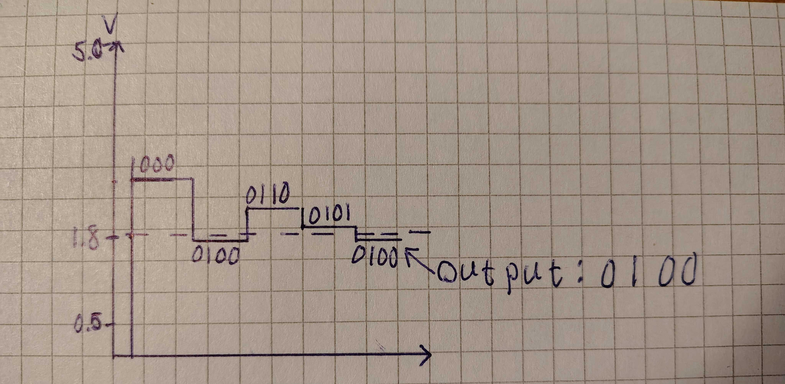
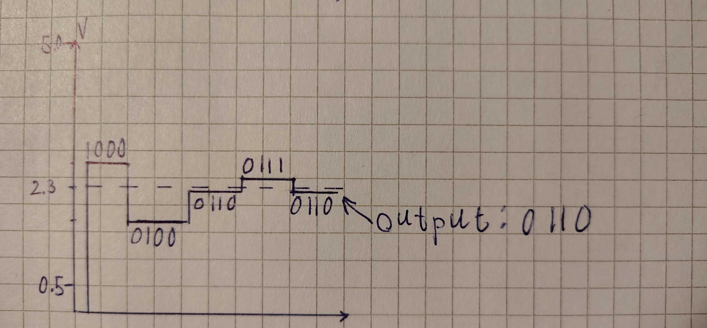
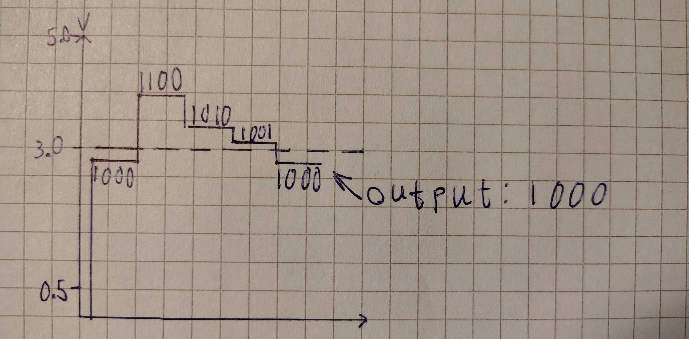
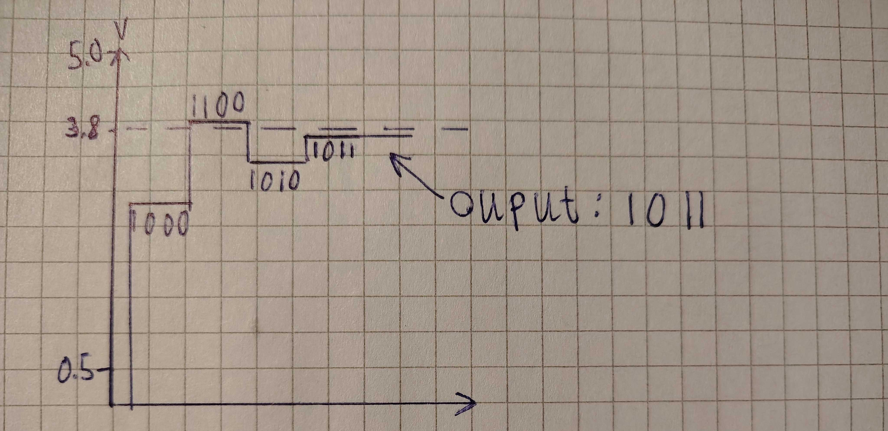
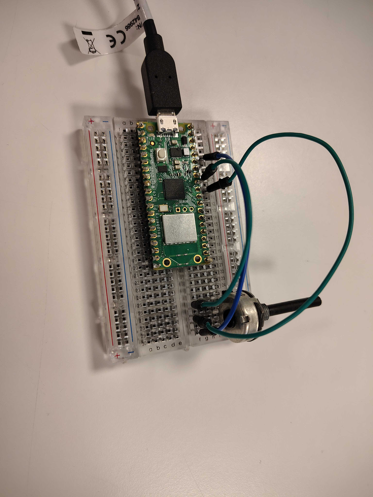
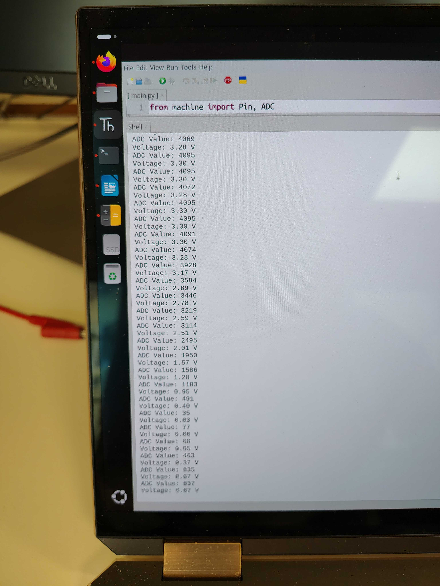

# 2DT903 : Lab 1 : [Samuel Berg(sb224sc)](mailto:sb224sc@student.lnu.se)

## Task 1

```powershell
Nyquist criterion formula: fs >= 2 x fmax

f1 = 1.75 kHz
f2 = 2 kHz
f3 = 3 kHz
=> fmax = 3 kHz
given_fs = 5 kHz

compute needed_fs:
needed_fs >= 2 x fmax = 2 x 3 kHz = 6 kHz

=> given_fs < needed_fs

=> The sampling rate of 5 kHz that we have is not enough to perfectly reconstruct to original signal,
this according to the Nyquist criterion.
```

## Task 2

### Solution

```powershell
Vmin = 0.5 V (="0000")
Vmax = 5.0 V (="1111")
N = 4

step_size = (Vmax - Vmin) / (2^N - 1) = (5.0 V - 0.5 V) / (2^4 - 1) = 4.5 V / 15 = 0.3 

V1 = 1.8 V
V2 = 2.3 V
V3 = 3.0 V
V4 = 3.8 V

V1 (="XXXX") => 
(((5 - 0.5) / 2) + 0.5) = 2.75 > 1.8 V -> 0
(((2.75 - 0.5) / 2) + 0.5) = 1.625 < 1.8 -> 1
(((2.75 - 1.625) / 2) + 1.625) = 2.1875 > 1.8 -> 0
(((2.1875 - 1.625) / 2) + 1.625) = 1.90625 > 1.8 -> 0
=> (="0100")

V2 (="XXXX") => 
(((5 - 0.5) / 2) + 0.5) = 2.75 > 2.3 V -> 0
(((2.75 - 0.5) / 2) + 0.5) = 1.625 < 2.3 -> 1
(((2.75 - 1.625) / 2) + 1.625) = 2.1875 < 2.3 -> 1
(((2.75 - 2.1875) / 2) + 2.1875) = 2.46875 > 2.3 -> 0
=> (="0110")

V3 (="XXXX") => 
(((5 - 0.5) / 2) + 0.5) = 2.75 < 3.0 V -> 1
(((5 - 2.75) / 2) + 2.75) = 3.875 > 3.0 -> 0
(((3.875 - 2.75) / 2) + 2.75) = 3.3125 > 3.0 -> 0
(((3.3125 - 2.75) / 2) + 2.75) = 3.03125 > 3.0 -> 0
=> (="1000")

V4 (="XXXX") => 
(((5 - 0.5) / 2) + 0.5) = 2.75 < 3.8 V -> 1
(((5 - 2.75) / 2) + 2.75) = 3.875 > 3.8 -> 0
(((3.875 - 2.75) / 2) + 2.75) = 3.3125 < 3.8 -> 1
(((3.875 - 3.3125) / 2) + 3.3125) = 3.59375 < 3.8 -> 1
=> (="1011")
```

### Diagrams:

#### V1



#### V2



#### V3



#### V4



## Task 3

### First

```powershell
RP2040 Clock frequency = 48 MHz
ADC conversion time = 96 CPU clock cycles per conversion

fs := Clock frequency/Clock cycles per conversion

=> fs = 48 000 000 Hz / 96 = 500 000 Hz = 500 kHz
```

### Second

```powershell
N = 12 bits
Vmax = 3.3 V
Vmin = 0 V

ADC resolution = (Vmax - Vmin) / (2^N - 1)

=> resolution = (3.3 - 0) / (2^12 - 1) = 3.3 / 4095 = 0.000805861 V = approx 0.81 mV
```

### Third

Setup:


Code: 
```python
from machine import Pin, ADC
import utime

potentiometer = ADC(Pin(26))  # GP26 corresponds to ADC0

VREF = 3.3  # The Pico ADC reference voltage

def read_potentiometer():
    adc_value = potentiometer.read_u16()  # Returns a 16-bit value 
    adc_value_12bit = adc_value >> 4      # Convert it to 12-bit resolution (0 to 4095)
    
    # Convert ADC value to voltage
    voltage = (adc_value_12bit / 4095) * VREF
    
    return adc_value_12bit, voltage

while True:   
    adc_value, voltage = read_potentiometer()
    
    print("ADC Value: {}".format(adc_value))
    print("Voltage: {:.2f} V".format(voltage))
   
    utime.sleep(0.5)
```

Output:

