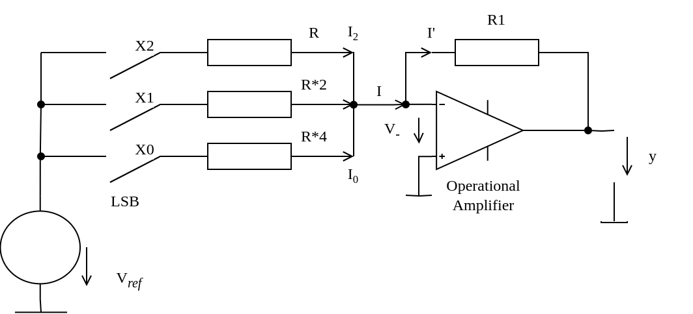

# 2DT903 : Lab 2 : [Samuel Berg(sb224sc)](mailto:sb224sc@student.lnu.se) & [Jesper Wingren(jw223rn)](mailto:jw223rn@student.lnu.se)

## Task 1


*Showcasing the circuit the below calculation is for(Taken from lab description document)*

```powershell
R24 = R2 + R4
R35 = R3 + R5

Rin = R1 + (R24 * R35)/(R24 + R35)

Rf = R6     (feedback resistance)

g_closed = -(Rf/Rin) = -(R6/(R1 + (R24 * R35)/(R24 + R35)))

=> Vout = g_closed * Vin = -(R6/(R1 + (R24 * R35)/(R24 + R35))) * Vin
```

## Task 2


*3-bit DAC circuit(Made using drawio)*

```powershell
X = {X0, X1, X2} where X2 is the MSB & X0 is the LSB

X2 = 1/2 * Vref (Due to being MSB)
X1 = 1/4 * Vref
X0 = 1/8 * Vref (Due to being LSB)
=>
Vout = Vref * (X2/4 + X1/4 + X0/8)

Example: 
If we have the bit value 101, which is represented by X = {1, 0, 1} then, 
Vout = Vref * (1/2 + 0/4 + 1/8) = Vref * (4/8 + 0/8 + 1/8) = Vref * 5/8
and this is correct due to (101(in base 2) = 5(in base 10))

Conclusion:
The output voltage of a 3-bit DAC is linearly proportional to the value represented by the input vector X as demonstrated. 
```

## Task 3

### Data preview

***Image of dashboard(python implementation)***


[Link to dashboard(python implementation)](https://app.datacake.co/pd/0276f2c5-9a61-4e08-87d3-b2f182c03933)

[Video of the C code running](https://youtube.com/shorts/zWvzqauL3pM?feature=share)

### Code

#### Python implementation(sending sensor data to datacake via mqtt)

```python
import network
import time
import machine
import umqtt
import ubinascii
import dht
import json 

ssid = 'wifi-name'
password = 'wifi-pass'
topic = "Samuel/RPIPico"
btn = machine.Pin(0, machine.Pin.IN)
led = machine.Pin(1, machine.Pin.OUT)
dht = dht.DHT11(machine.Pin(16))

mqtt_c = None

def conn_wifi():
    wlan = network.WLAN(network.STA_IF)
    wlan.active(True)
    
    if not wlan.isconnected():
        print(f"Connecting to Wi-Fi: {ssid}")
        wlan.connect(ssid, password)
        
        while not wlan.isconnected():
            time.sleep(1)
            print(" .", end="")
    
    print("\nConnected to Wi-Fi")
    print(wlan.ifconfig()) 

def conn_mqtt():
    global mqtt_c
    try:
        mqtt_c = umqtt.MQTTClient(client_id=ubinascii.hexlify(machine.unique_id()).decode(), server="broker.emqx.io", port=1883, user="", password="")
        mqtt_c.connect()
        print("Connected to MQTT")
    except Exception as e:
        print(f"Failed to connect to MQTT: {e}")
        mqtt_c = None

def p_msg(mqtt_c, topic, message):
    
    if mqtt_c:
        try:
            mqtt_c.publish(topic, message)
            print(f"Message published to {topic}: {message}")
        except Exception as e:
            print(f"Failed to publish message: {e}")
    else:
        print("MQTT client not connected.")
    led.off()

def msg_cb(topic, msg):
    print(f"Received message: {msg.decode()} from topic: {topic.decode()} \n")
    if msg.decode() == "Data comming..." or msg.decode() == "Btn data comming...":
        temp()
        p_msg(mqtt_c, topic, "Data ending...")
    else:
        led.on()

def sub_topic(mqtt_c, topic):
    if mqtt_c:
        mqtt_c.set_callback(msg_cb)
        try:
            mqtt_c.subscribe(topic)
            print(f"Subscribed to {topic}")
        except Exception as e:
            print(f"Failed to subscribe to topic: {e}")
    else:
        print("MQTT client not connected.")

def btn_cb():
    if btn.value() == 1:
        time.sleep(0.05)
        if btn.value() == 1:
            return True
    return False

def temp():
    dht.measure()
    temp = dht.temperature() 
    hum = dht.humidity()

    payload = json.dumps({"temp": temp, "hum": hum})
    p_msg(mqtt_c, topic, payload)

def main():
    conn_wifi()
    conn_mqtt()
    
    if mqtt_c:
        sub_topic(mqtt_c, topic)
        
        try:
            elapsed_time = time.time()
            
            while True:
                mqtt_c.check_msg()
                
                if time.time() - elapsed_time >= 300:
                    p_msg(c, topic, "Data comming...")
                    elapsed_time = time.time()
                
                if btn_cb():
                    led.on()
                    p_msg(mqtt_c, topic, "Btn data comming...")
                    time.sleep(0.5)
                led.off()
                
        except KeyboardInterrupt:
            print("Disconnecting from MQTT...")
            if mqtt_c:
                mqtt_c.disconnect()

main()
```

##### Datacake uplink code

```javascript
function Decoder(topic, payload) {
    try {
        payload = JSON.parse(payload);
        
        var Temp = payload.temp;
        var Hum = payload.hum;
        
        return [
            {
                device: "25590695-dd0b-4f08-8f74-987e68bd6ac0",
                field: "TEMP",
                value: Temp
            },
            {
                device: "25590695-dd0b-4f08-8f74-987e68bd6ac0",
                field: "HUM",
                value: Hum
            }
        ];
    } catch (error) {
        console.error("Failed", error);
        return [];
    }
}
```

#### C implementation(no networking)

```c
#include <stdio.h>
#include <dht.h>
#include "pico/stdlib.h"
#include "FreeRTOS.h"
#include "task.h"

#define BTN_PIN 0
#define LED_PIN 1
#define DHT_PIN 16

static const dht_model_t DHT_MODEL = DHT11;
dht_t dht;

// Periodically check temp & hum, if DHT returns error improper data is returned
void temp_task(void *pvParameters) {
    for (;;) {
        dht_start_measurement(&dht);
        
        float temp;
        float hum;
        dht_result_t res = dht_finish_measurement_blocking(&dht, &hum, &temp);

        if (res == DHT_RESULT_OK) {
            printf("Temperature: %.1f °C, Humidity: %.1f%%\n", temp, hum);
        } else if (res == DHT_RESULT_TIMEOUT){
            printf("DHT sensor not responding. Please check your wiring.\n");
        } else {
            assert(result == DHT_RESULT_BAD_CHECKSUM);
            puts("Bad checksum");
        }

        vTaskDelay(pdMS_TO_TICKS(2000));
    }
}

// On button press turn LED ON/OFF dependent on previous state
void btn_task(void *pvParameters) {
    bool ledState = false;

    while (1) {
        printf("Button state: %d\n", gpio_get(BTN_PIN));
        if (gpio_get(BTN_PIN)) {
            ledState = !ledState;
            gpio_put(LED_PIN, ledState);
            vTaskDelay(pdMS_TO_TICKS(500));
        }
        vTaskDelay(pdMS_TO_TICKS(50));
    }
}

int main() {
    stdio_init_all();
    
    // Init LED
    gpio_init(LED_PIN);
    gpio_set_dir(LED_PIN, GPIO_OUT);

    // Init button
    gpio_init(BTN_PIN);
    gpio_set_dir(BTN_PIN, GPIO_IN);
    gpio_pull_up(BTN_PIN);

    // Init DHT sensor
    dht_init(&dht, DHT_MODEL, pio0, DHT_PIN, true);

    // Create tasks
    xTaskCreate(temp_task, "tempTask", configMINIMAL_STACK_SIZE, NULL, 1, NULL);
    xTaskCreate(btn_task, "btnTask", configMINIMAL_STACK_SIZE, NULL, 1, NULL);

    vTaskStartScheduler();

    while (1); // <- Shall never be reached
    return 0;
}
```

### Report

#### 1. Introduction 

- Demonstrating the necessity of an RTOS.
- Implementing a similar project in both **Python** and **C**(due to constraints).
- Overview of real-time requirements that MicroPython alone cannot meet.

#### 2. Project overview

##### Hardware setup

- **RPi Pico W 2040**: Microcontroller.
- **DHT11 Sensor (Pin 16)**: Measures temperature and humidity.
- **Button (Pin 0)**: User input.
- **LED (Pin 1)**: Visual feedback.
- **Wi-Fi Module**: Onboard Pico W for wireless communication.

##### Communication protocol

- Using MQTT over Wi-Fi.
- Server: `"broker.emqx.io"`.
- Topic: `"Samuel/RPIPico"`.
- Sending sensor data and publishing it to datacake via MQTT.

#### 3. Real-time requirements

##### Python

Real-time constraints:
- **Button press**: Immediate response to user input & light LED until button press data reaches MQTT.
- **Sensor data transmission**: Collect and transmit data every 30 seconds.
- **Wireless communication**: Real-time communication over Wi-Fi to an MQTT broker.

##### C

Real-time constraints:
- **Button press**: Immediate response to user input & light LED.
- **Sensor data**: Collect and print data every 2000 ticks.


**Task delays**: A delayed response (missing button presses or delayed sensor data) impacts the system. If a safety critical system the consequences can be drastic.

#### 4. MicroPython implementation

##### Real-time challenges in MicroPython

- **No task prioritization**: Sequential task execution can cause delays.
- **Blocking operations**: Network or sensor delays block other tasks.
- **Hardware interrupts**: Lack of hardware interrupts leads to inefficient real-time performance.

##### Test results

- **Observed issues**: Delayed sensor readings, slow publish times to MQTT.

This demonstrates the need for RTOS.

#### 5. C implementation
 
##### Advantages of C with RTOS

- **Precise task scheduling**: Meeting real-time constraints through prioritized tasks.
- **Non-blocking behavior**: Tasks can yield control for immediate responses.
- **Interrupt-driven events**: Efficient handling of button presses and critical tasks.

##### Test results

- **Improved responsiveness**: Faster reaction to button presses, consistent sensor data.

This demonstrates how RTOS in C meets the real-time requirements in comparison to the MicroPython implementation which **did not**.

#### 6. Comparison and evaluation

##### MicroPython vs C with RTOS

|Feature            | **MicroPython**                                    | **C**                                              |
|--------------------|----------------------------------------------------|----------------------------------------------------|
| **Ease of Use**     | Easier to write and debug. | More complex syntax. Better for optimized, performance-critical applications. |
| **Performance**     | Slower due to the level of abstraction and its interpreted nature. | Higher performance due to compiled code, direct memory access and less overhead. |
| **Real-Time Capabilities** | Limited real-time control, less suitable for strict timing constraints. | Highly suitable for real-time tasks, better timing accuracy, and more predictable behavior. |
| **Libraries and Ecosystem** | Extensive libraries for sensors, communication, and quick development. | Rich library support, but requires more effort to integrate and manage. |

#### 7. Conclusion

RTOS is essential for real-time tasks due to the strict timing requirements involved in many embedded systems.

**MicroPython** is ideal for simplifying work with sensors, wireless communication, and I/O operations. Its abstractions allow for faster development, but it struggles with real-time performance due to overhead and less precise timing control. It is suited for projects that prioritize ease of use.

**C** on the other hand, offers greater control over hardware and enables more accurate timing, making it well-suited for real-time systems. Though more complex and time-consuming to develop, C provides the performance and real-time guarantees that MicroPython lacks, especially when combined with an RTOS.
